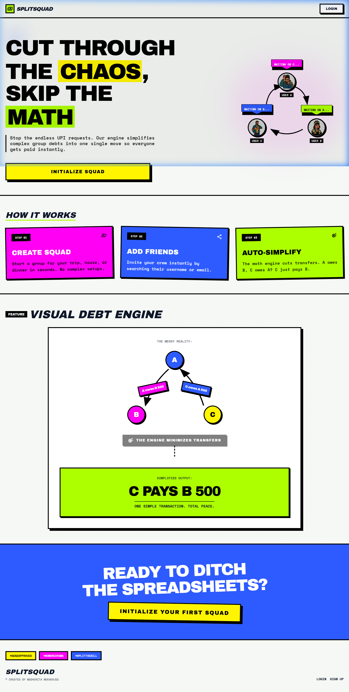

# 🟩⬛ SplitSquad ⬛🟩

<p align="center">
  
  
  
  
</p>

> **Cut through the chaos, skip the awkward.** 
> The ultimate *Neo-Brutalist* group expense splitter that simplifies your debts into one single move so everyone gets paid instantly.

---

## 📸 Visuals

*(Add your screenshots or a GIF here showcasing the app's UI, such as the Dashboard, Group Detail, and Visual Debt Engine.)*

<p align="center">
  
</p>

---

## ⚡ What is SplitSquad?

**Stop the endless UPI requests.** SplitSquad is your modern, no-nonsense debt tracking engine. We simplify complex group debts into **one single move** so everyone gets paid instantly. 

Designed with a bold, unapologetic **neo-brutalist aesthetic** (thick borders, uppercase fonts, and popping neon colors), it proves that tracking money doesn't have to be boring.

A owes B, C owes A? **C just pays B.** Simple.

---

## 🚀 Key Features

- **🎯 Auto-Simplify Debt Engine**: Our math engine cuts out middleman transfers. Minimizes total transactions to settle group debts effortlessly.
- **👁️ Visual Debt Engine**: Built-in 2D force-directed graphs so you can actually *see* who owes who.
- **📱 Real-Time QR Settlements**: Direct UPI QR code generation to settle debts right on the spot.
- **⏱️ Recurring Expenses**: Automate those monthly rent or subscription splits.
- **🔔 Real-time Notifications**: Get beautifully crafted notifications when expenses are added or settled.
- **🎨 Neo-Brutalist UI**: Stunning, accessible, and uniquely styled user interfaces.

---

## 🛠️ Technology Stack

### Client (Frontend)


- Visualizations: `react-force-graph-2d`
- QR Codes: `qrcode.react`
- Routing & State: `react-router-dom`, `context`

### Server (Backend)


- Authentication: JWT & bcryptjs
- Security: `express-rate-limit`, `cors`
- Jobs: `node-cron`
- Middleware: Custom global error & `notFound` handler

---

## 🏁 How it Works

1. **Step 01 - Create Squad**: Start a group for your trip, house, or dinner in seconds. No complex setups.
2. **Step 02 - Add Friends**: Invite your crew instantly by searching their username or email.
3. **Step 03 - Auto-Simplify**: Add expenses. The engine minimizes transfers automatically.

---

## 💻 Installation & Usage

Follow these steps to get the project running locally.

### Prerequisites

- Node.js (v18+ recommended)
- MongoDB running locally or a MongoDB Atlas URI

### Installation

1. **Clone the repository**
   ```bash
   git clone https://github.com/Madhurita19/SplitSquad.git
   cd SplitSquad
   ```

2. **Setup the Backend Server**
   ```bash
   cd server
   npm install
   ```
   *Create a `.env` file in the `server` directory with your config:*
   ```env
   PORT=5000
   MONGO_URI=your_mongodb_connection_string
   JWT_SECRET=your_jwt_secret
   NODE_ENV=development
   ```
   *Run the server in development mode:*
   ```bash
   npm run dev
   ```

3. **Setup the Frontend Client**
   Open a new terminal window:
   ```bash
   cd client
   npm install
   ```
   *Run the client:*
   ```bash
   npm run dev
   ```

4. **Initialize Your First Squad**
   Open your browser to the local Vite port (usually `http://localhost:5173`) and start splitting!

---

## 🤝 Contributing Guide

Contributions, issues, and feature requests are welcome! 

1. Fork the Project
2. Create your Feature Branch (`git checkout -b feature/AmazingFeature`)
3. Commit your Changes (`git commit -m 'Add some AmazingFeature'`)
4. Push to the Branch (`git push origin feature/AmazingFeature`)
5. Open a Pull Request

Feel free to check the [issues page](https://github.com/Madhurita19/SplitSquad/issues) if you want to contribute.

---

## ©️ Authors & Acknowledgements

Created by **Madhurita Mukherjee**. 

- Built with inspiration from neo-brutalism design trends.
- Thanks to the open-source community for the tools and libraries that made this possible.

---

## 📬 Contact Information

Reach out if you have any questions or just want to connect!

- **GitHub**: [@Madhurita19](https://github.com/Madhurita19)
- *(Add any extra social links like LinkedIn or Email here)*

---
*#GenZApproved #NoMoreDrama #SplitTheBill*
